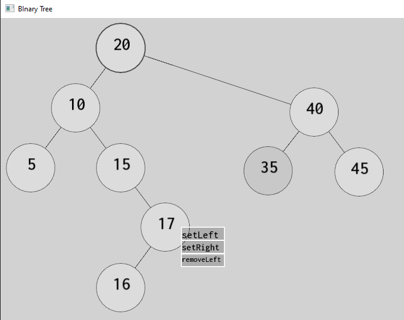

# nodes-frontend
Data structure and algorithm visualizer/integration for your programs. Currently supports node-based algorithms and their variations such as:

* linked lists (singly/doubly)
* generic trees and graphs
* binary trees

See `examples` for demo projects

## Intro

Consider you have a isolated piece of project you'd want to explain to someone or just debug it through the code you are writing yourself. No debuggers, no constant print out, just your code with similar semantics.

The goal of this project is to provide tooling for algorithm explanation with customizable options to explore at your own pace with possibility to move/change structures in real time.

## Docs

Every class is commented to work with *doxygen* document generation. *Doxygen* (https://www.doxygen.nl/) documentation contains class inheritances, class descriptions, their purpose and UML diagrams and relies on *Graphviz* (https://www.graphviz.org/). You can use `Doxyfile` (e.g. with *Doxywizard*) or compile docs yourself through CLI.

If using `Doxyfile`, in file specify:
* `OUTPUT_DIRECTORY` as output location of generated docs,
* `INPUT` as full path to the project root,
* `DOT_PATH` as full path to the *Graphviz* binaries (e.g. `C:/Graphviz/bin`).

Architectural docs are located in `docs` directory

**Notice**: release package contains all the docs

## Prerequisites

### For release

* Just grab latest release, it contains SFML distribution, standard C++ library (MSYS) and all the compiled examples

### For compilation

* buildutils (gcc, ar, ld)
* SFML 2.5.1 library
* Cmake >= 3.13

## Usage

Integrate necessary structures that are available in `include/nf.hpp` into your program. See header files listed in `include/nf.hpp` for available methods to use with given data structure.

Minimal example as follows:
```cpp
// 1: Include header
#include "nf.hpp"

// 2: Define [static] wrapper instance and macro ...
nf::NodeFrontEndWrapper NFWrap;
#define WRAPPER NFWrap

// 2.1: You can use custom settings

/*
static nf::NodeFrontEndWrapper NFWrap(nf::Context{
    sf::VideoMode{1920, 1080},
    sf::ContextSettings{24, 8, 8, 3, 0}
});
*/

// 3: Define your structure that you want to use. In this case it's BT.
//
// Node ctor takes defined nf wrapper
//
// Node template takes your class as it's first argument and data type of
// underlying data as second argument. That means you can define custom
// structure/class to be stored in your BT node and overload
// `representation` method to display data on screen. See `src/main.cpp`
// for more info

struct Person
{
    std::string name;
    short age;
};

struct StringBTNode : public nf::BinaryTreeNode<StringBTNode, Person> {
    StringBTNode() : BinaryTreeNode<StringBTNode, Person>(NFWrap.api()) {}

    std::string representation() override {
        return std::string("['"
            + getData().name
            + "', "
            + std::to_string(getData().age)
            + "]");
    }
};

// 4: Initialize API in entry
int main() {
    NFWrap.init("Title is optional");

    // ... your operations, tree traverse, heapifying, ...

    // 5: Launch the loop
    START_LOOP;
    return 0;
}
```

**Important!** Each operation (node inserts, deletions, updates) need to be managed manually - that is you should specify delay after each action, for example:

```cpp
// ... we are currently traversing the binary tree ...

void _postOrderPrintRec(Node *node)
{
    if (!node) return;
    _postOrderPrintRec(node->getLeft());
    _postOrderPrintRec(node->getRight());
    // Access the data
    cout << " " << node->getData();
    // Highlight node on screen
    node->highlight();
    // Wait to see changes made on sreen
    nf::Utils::delay(250);
}

// ...
```

Compile and launch. You'll see that some algorithms have automatic offset during node spawning. You can also reset it using `setPosition(x,y)`.

Binary tree example looks as follows (notice: node with value 40 was dragged to the right using mouse to avoid overlap):



* Node with bold outline - programmatically highlighted node using `highlight()` method
* Node with dimmer background - last selected node using mouse (left click)
* Container with directives - contextual menu (right click) which is relative to the node that it was pressed on, i.e. node with value 17 has operations to remove currently assigned left child or set selected node with value 35 as right or left child.
Nodes have on-self sanity check should you try to perform, for example, `setLeft` on node from which contextual menu is being invoked.

## Controls

LMB - select node for contextual use
RMB - invoke contextual menu
Left Alt - delete node
Mouse wheel up/down - scroll up or down
Left Shift + Mouse wheel up/down - scroll left or right

# How to

## compile it yourself:
1. Get yourself SFML 2.5.1 libraries (window, graphics, system) somewhere
2. Create `.env` file in project root (i.e alongside this README file) and specify SFML_PREFIX (see `.env.example`) where your libs are located
3. Important! Project compiles using MSYS MinGW, change all `-G "MSYS Makefiles"` flags inside of `./configure.sh` if necessary
4. Launch `./configure.sh` script: this will create release config with example program
5. Run `./build.sh --run` to compile and run the program
Program itself and necessary resources will be placed into `SFML_PREFIX/bin` directory

All code and tests for example program are located in `main.cpp`

## compile examples:
1. Get yourself SFML 2.5.1 libraries (window, graphics, system) somewhere
2. Create `.env` file in project root (i.e alongside this README file) and specify SFML_PREFIX (see `.env.example`) where your libs are located
3. Go to `examples` and choose program
4. Run `compile.sh`. It will create and copy binary into the `SFML_PREFIX/bin` folder

## use library with your programs:
1. Create static library:
    1. Compile all resources (steps 3 and 4 from compilation steps, use `./build.sh` instead to avoid program launch)
    2. Run `./couple.sh`. This will create `libnf.a`
2. Move files where your program is located so your environment would consist of:
     * your program
     * `libnf.a`
     * `sfml-graphics-2.dll`/`sfml-graphics-2.so`
     * `sfml-system-2.dll`/`sfml-system-2.so`
     * `sfml-window-2.dll`/`sfml-window-2.so`
     * `resources` folder (available in root project)
3. Compile (e.g. using gcc):
```
g++ binary_tree.cpp -o binary_tree.exe -I ./include -I <SFML_include_dir> -L <SFML_lib_dir>./libnf.a -lsfml-window -lsfml-graphics -lsfml-system
```
