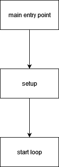

# Design

Refer to the exhibit below:

User defines `int main()` to be the main entry point for all frontend operations. This includes (in described order):
* cache initialization,
* resource allocation (fonts, system cursors),
* interface initialization,
* creation of a window,
* creation of an event queue and event thread.

After environment was initialized, setup block steps in to configure:
* window configs (in case they are changed by user),
* entities (but not all and only its abstract representation) that can be accessed through strictly defined API,
* entity location and look-and-feel of a scene,
* algorithms and sequential operations which will be applied to the entities.

Finally loop block applies all specified actions (events) to the allocated objects and draws everything on screen. After programmatically user-configured code is done it still listens to incoming events - mouse presses, scrolls.

## "Game" loop

Main loop updates and draws scene changes relative to events received.

Event is either system action (user key input) performed in scope of a window or a called directive using API.

It is designed in such a way that event handler/thread is separated from main loop which also is running constantly. Communication between event  and main threads is done through thread-safe queue.

## Events

Upon calling some action (`setData`, `getLeft`, ...) or invoking event through user input, API wrapper either pushes event into queue or makes direct call to the active scene through `updateInput` method. Scene reacts accordingly to event received and can return pointer to some object (just created, queried, etc.).

## Design decisions

Current design allows expansion in terms of new entity types, scene switches (e.g. multiple pages) and static UI for tooling.
